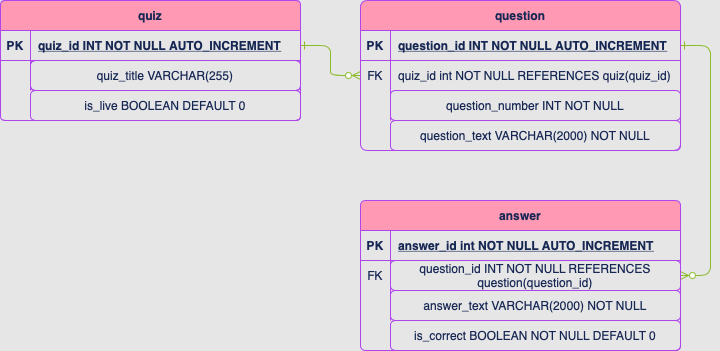
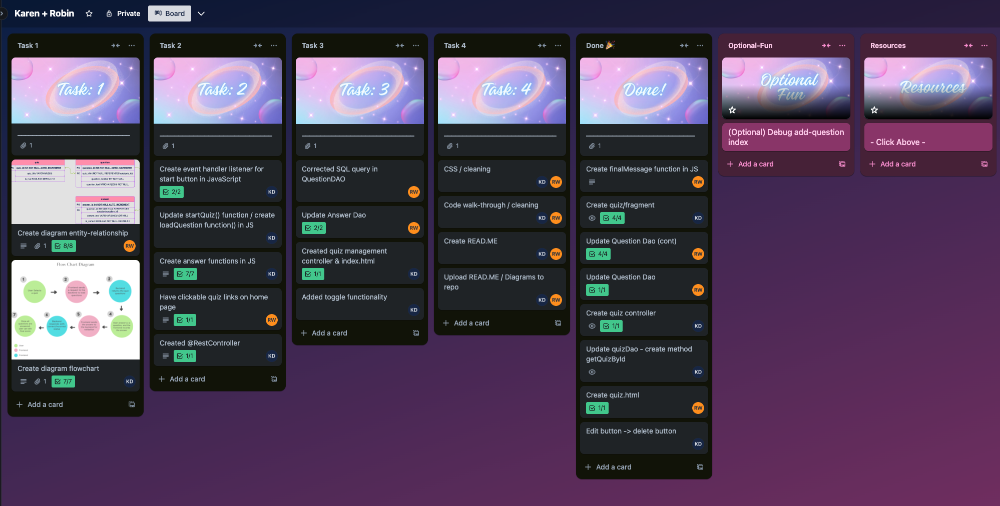
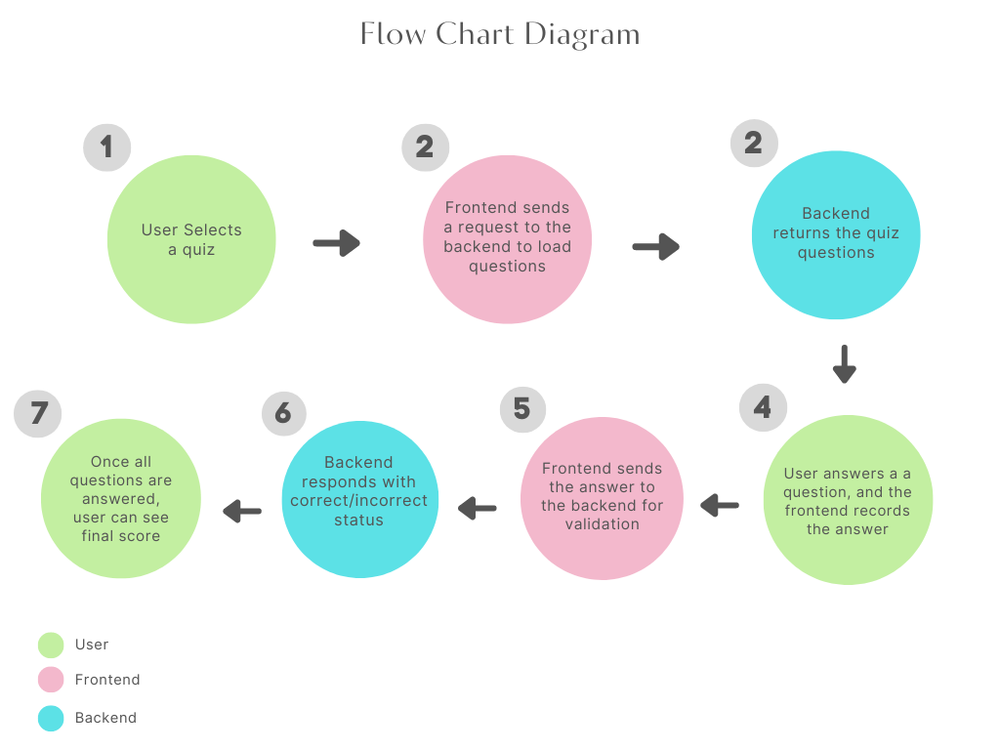
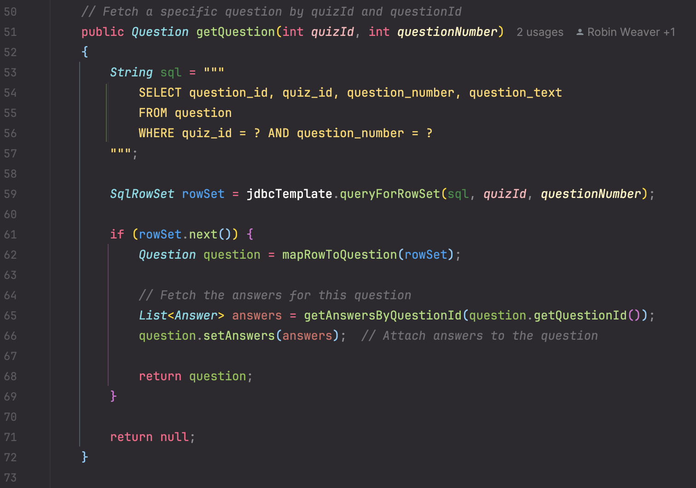
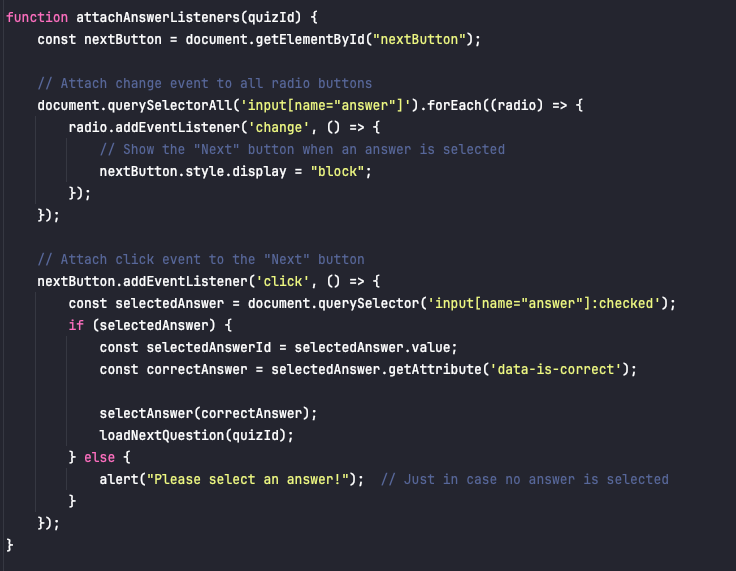

# Trivio Quiz Application

Trivio is a fun and interactive quiz application where users can test their knowledge on various topics. The app features a dynamic interface with pixel art styling, multiple-choice questions, and a scoring system to track your performance. Built using Java, Thymeleaf, Spring Boot, and JavaScript, Trivio provides a smooth user experience with real-time quiz progression.
## Features

- **Quiz Selection:** Browse from a list of available quizzes.
- **Dynamic Questions:** Each quiz presents a set of dynamically loaded multiple-choice questions.
- **Editable Quizzes:** Users can view in-depth details of each quiz and delete questions as desired.
- **Score Tracking:** Keep track of your score and see how many questions you answered correctly at the end of the quiz.
- **Responsive UI:** Enjoy a visually appealing interface, complete with pixel art fonts and styled buttons, across all devices.

## Development Process
To plan our development, we used a Trello kanban board to delegate tasks, an entity relationships diagram to organize database queries, and a step-by-step flowchart to showcase communication between the front-end and back-end.

## Challenges

**What was the problem?** 

This project used JavaScript extensively which was difficult to grasp within only a few days of learning. We implemented many functionalities of JavaScript such as dynamically displaying single question, event handling, and fetching the correct api. 

**How do you approach the problem?** 

In order to understand the problem we added many debugging points to gather more information on what was happening while our application was running. Including console.log outputs where IntelliJ did not allow break points. We utilized the DOM to be able to give us more useful information in order to tackle the problem. 

**What was the final solution?**

Once we gathered all the information through debugging and testing we were able to work out all of our syntax, formatting, and logic corrections. 

**Robin's favorite block of code:**

Modifying this SQL query allowed us to make code we had already written more dynamic and robust!

**Karen's favorite block of code:**

Created a function that allowed users to select an answer and dynamically change the load out of the page!

## Retrospective

**What did you learn from the project?** 

In this project we learned how to coordinate a web application to a users input from frontend to backend to give the correct output. We learned how to effectively coordinate how all necessary programming languages work together to create an application. 

**What would you do differently?** 

Write more pseudocode to plan functionalities and execution of code. Start planning with the end result and work backwards to have a clearer vision from start to finish.

**What would you do the same?** 

From the beginning we were consistently trying to get useful error messages through debugging by adding console.logs and breakpoints. Working through functionalities before worrying about styling and frontend design.

**If you had more time, what else would you add to the project?**

We would like to add a full edit functionality to improve users experience. We also want the new quiz and question form to have both client and server side validation. Lastly, we would like to add more quizzes in our database so users are able to fully experience a variety of Trivio quizzes.